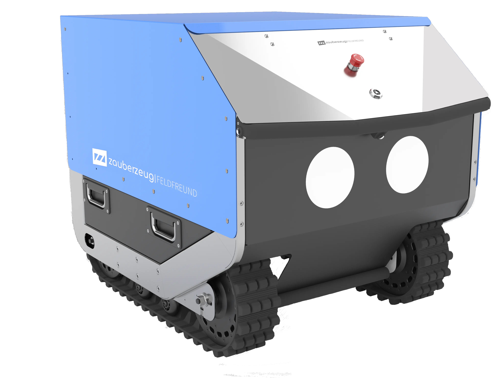

# Zauberzeug Field Friend

This is an example implementation of an mechanical weeding robot with [RoSys](https://rosys.io).
The full system is build by [Zauberzeug](http://zauberzeug.com) as a development platform to advance organic and regenerative agriculture.



## Features

- full control via web interface
- 3D visualization of the robot and it's detected surrounding
- manual steering with touch-joystick and keyboard
- camera/motor calibration for real world coordinate system (unit: meters)
- ...

## Getting Started

```bash
python3 -m pip install rosys
git clone git@github.com:zauberzeug/field_friend.git
cd field_friend
./main.py
```

This will start the simulated robot and open the user interface in your browser.

## On Real Hardware

The following instructions will only work if you have a real "Zauberzeug Field Friend" at your disposal.
Contact [sales@zauberzeug.com](mailto:sales@zauberzeug.com) if you are interested in a non-profit purchase of this development hardware.

1. make sure you can login via ssh without providing a password (via `ssh-copy-id` command)
2. get [LiveSync](https://github.com/zauberzeug/livesync) to hot-deploy local code to the machine: <br>
   `git clone git@github.com:zauberzeug/livesync.git`
3. go to your local `field_friend` folder and start LiveSync: <br>
   `livesync <ssh-host-name-of-field-friend>`
4. this will deploy your local code to the Field Friend
5. as long as [LiveSync](https://github.com/zauberzeug/livesync) is active, all code change are automatically pushed to the machine
6. the new code will automatically trigger a reload on the Field Friend
7. to watch the log output of the remote machine: login via ssh and run <br>
   `tail -f ~/.rosys/debug.log`

### Update RoSys

On the machine you can update RoSys by logging in and running

```bash
cd ~/field_friend
./docker.sh pull
./docker.sh up
```
